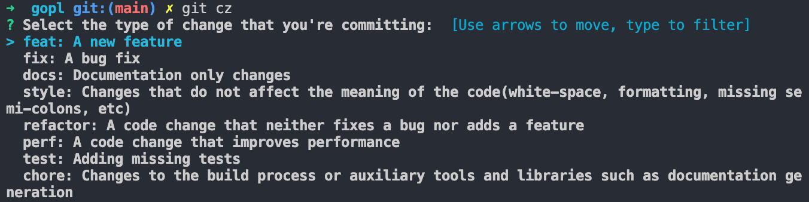

# Commitizen
[](https://github.com/robertzhangwenjie/commitizen/actions/workflows/test.yml)
[](https://codecov.io/gh/robertzhangwenjie/commitizen)
[](https://goreportcard.com/report/github.com/robertzhangwenjie/commitizen)

A git commit message generator for standardizing our commit msg

# Getting Started

## Installation with source code
Checkout the project and run `make install`, the following output below indicates install successfully:

```shell
...
Git SubCommand installed successfully, run with "git cz".
```

# Usage
```git cz```


# Configuration
You can customize your commit configuration to project root path or user home directory  with json file .git-czrc which format like below:
```json
{
	"items": [
			{
				"name": "type",
				"desc": "Select the type of change that you're committing:",
				"form": "select",
				"options": [
					{ "name": "feat", "desc": "A new feature" },
					{ "name": "fix", "desc": "A bug fix" },
					{ "name": "docs", "desc": "Documentation only changes" },
					{
					  "name": "style",
					  "desc":
						"Changes that do not affect the meaning of the code(white-space, formatting, missing semi-colons, etc)"
					},
					{
					  "name": "refactor",
					  "desc": "A code change that neither fixes a bug nor adds a feature"
					},
					{
					  "name": "perf",
					  "desc": "A code change that improves performance"
					},
					{ "name": "test", "desc": "Adding missing tests" },
					{
					  "name": "chore",
					  "desc":
						"Changes to the build process or auxiliary tools and libraries such as documentation generation"
					},
					{ "name": "revert", "desc": "Revert to a commit" },
					{ "name": "WIP", "desc": "Work in progress" }
				],
				"required": true
			},
			{
				"name": "scope",
				"desc": "Scope. Could be anything specifying place of the commit change (users, db, poll):",
				"form": "input"
			},
			{
				"name": "subject",
				"desc": "Subject. Concise description of the changes. Imperative, lower case and no final dot:",
				"form": "input",
				"required": true
			},
			{
				"name": "body",
				"desc": "Body. Motivation for the change and contrast this with previous behavior:",
				"form": "multiline"
			},
			{
				"name": "footer",
				"desc": "Footer. Information about Breaking Changes and reference issues that this commit closes:",
				"form": "multiline"
			}
		],
	"template": "{{.type}}{{with .scope}}({{.}}){{end}}: {{.subject}}{{with .body}}\n\n{{.}}{{end}}{{with .footer}}\n\n{{.}}{{end}}"
}

```